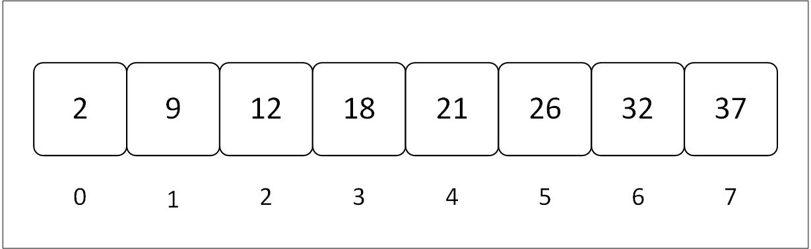

# **Array**
### An array is a collection of similar data types that are stored in contigous memory locations. Each location has an index number through which we can access the element at that particular index. 



- The array indexing starts from 0, that is why there are n + 1 elements in array. 
- As in this case there are 8 elements but the index goes up to 7 becuase it begins from 0.

`arr[2] = 10`
> Assigning value '10' to index 2 [that is at third position]
 ----------
 ### In Rust, an array can be defined in two methods. Each method comes with it's pors and cons. The two types of arrays in rust are: **Primitive type** and  **Vector type**.
  - Primitive type arrays contain basic types like integers or floats, while with `Vec` are dynamically resizable and owned by the heap. 

 **Primitive Yype Array**
 ```
 fn main(){
    let numbers: [i32, 4] = [1, 2, 3, 4] ;  // Fixed size array
    println!("Primitive array: {:?}", numbers) ;
 }
 ```

 **Vector Type Array**
 ```
 fn main() {
    let mut numbers = vec![1, 2, 3, 4]  // A dynamically-sized vector
    println!("Vector: {:?}", numbers) ;

    // Add an element
    numbers.push(5) ;
    println!("After adding 5: {:?}, numbers") ;

    //Remove an element
    numbers.pop() ;  
    println!("Numbers after popping{:?}", numbers) ;

 }
 ```

 > - **Arrays ([T; N]): Fixed size and allocated on the stack**
 > - **Vectors (Vec< T>): Dynamic and allocated on the heap** 