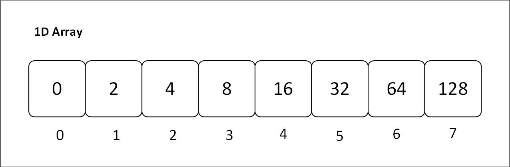
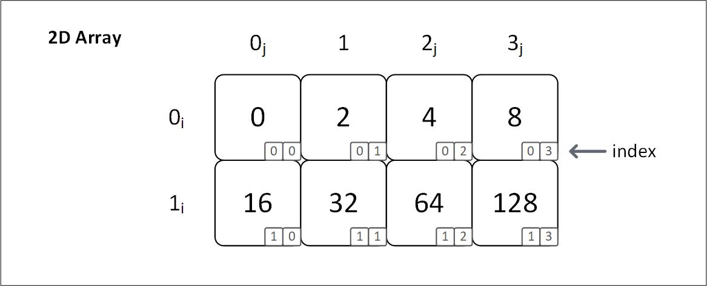

# **Primitive Type**

### **In Rust, primitive data types are those, which are built in and do not need in library to be used**

- **Scalrar Primitives**: Types that hold only single value, example -> i32, u32, f32, char, bool, etc.
- **Compound Primitives**: Types that hold more than one value, example -> Arrays, Tuples

------------------------
## Initializing a primitive array
```
    // default type is i32
    let arr = [1, 2, 3, 4, 5];
    println!("Array: {:?}", arr);
```
## **E: Expression, N: Number of times to repeat**
```
    // name: [T ; N] = [E; N];
    let arr: [u8; 4] = [9; 4]; 
    println!("Array: {:?}", arr); 
```
## **Accessing and modifying a primitive array**
```
    // Accessing an element
    let mut arr1_mut = [12, 20, 30, 40];
    let num = arr1_mut[0];
    println!("First element: {}", num);

    // array_name[index] = new_value;
    arr1_mut[0]= 10;
    println!("Modified array 1: {:?}", arr1_mut);
```
----------
-----------
## Types of Array: 

### 1D Array: 


### 2d Array: 

```
    const ROWS: usize = 4;
    const COLS: usize = 5;

    // name: [[ T;    C];    R]
    let arr: [[u8; COLS]; ROWS] = [[1; COLS]; ROWS];
    println!("Array: {:?}", arr); 
```