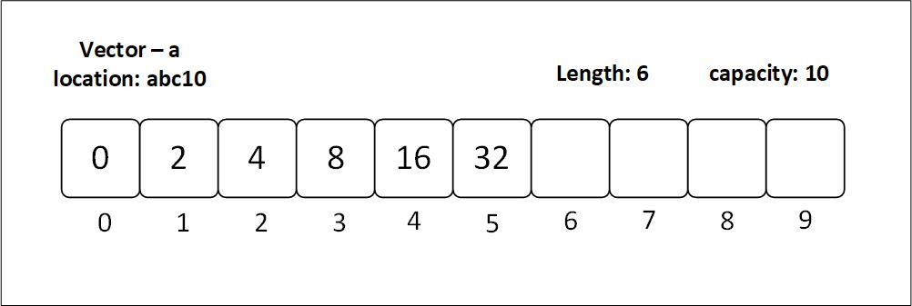

 # **Vector type** 
 
 - **Unlike arrays, a vector stores the size of the array as well. Arrays don't need to store their size. That is why we can access an array element even when we exceed the actual capacity. The boundaries are not defined**
 
 - Another thing about Vectors are that they are stored heap, and they hava a larger size allocated than is being used. As a result, when new values are inserted, the whole vector does not need to fulfill the size requirements. 
 

 ------------------------

 ## Initializing a Vector
 - While initializing a primitive we had to specify the size of the array before hand. There is no such constraints with Vector.

 ```
    // vector from inbuilt macro
    let vec:Vec <u16> = vec![10, 20, 30, 40, 50];
    println!("Vector array: {:?}", vec);

    // vector from array
    let vec = Vec::from([1, 2, 3, 4, 5]);
    println!("Vector array: {:?}", vec);

    // empty vector
    let mut _vec: Vec<u8> = Vec::new();

 ```


 ### **Vector Specific Functions**
 1. push(): This funtcion inserts an element at the end of the vector 
 2. pop(): This function Removes an element from the end of the vector
 3. len(): This functions outputs the number of elements in the vector


 ------------------------
 ## 2D Vector

 ```
    // empty 2D vector
    let mut _vec: Vec<Vec<char>> = Vec::new();

    // method 1:
    let vec: Vec<Vec<u8>> = Vec::from([Vec::from([1, 2, 3]), Vec::from([4, 5, 6])]);
    println!("2d vector: {:?}", vec);

    // method 2:
    let vec: Vec<Vec<u8>> = vec![vec![1, 2, 3], vec![4, 5, 6]];
    println!("2d vector: {:?}", vec);

 ```