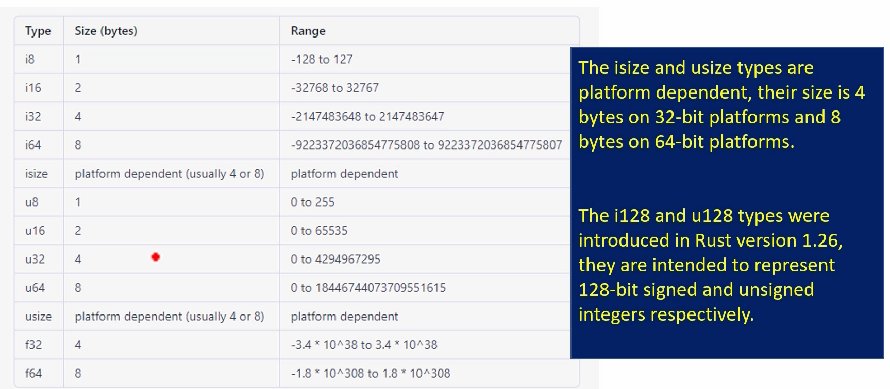

# Data Types (Primitives)

- Integers: i8, i16, i32, i64, isize, u8, u16, u32, u64, usize .
- FLoating point numbers: f32, f64 
- Boolean: bool
- Character: char 
- Arrays: [T, N], where T = type of elemets & N = number of elements
- Slices: &[T] 
- Tuples: A tuple is a fixed-length collection of elements, where each element can have a different type. They are defined by as et of parentheses enclosing a comma-separated list of types, (T1, T2, T3, ...)

## Rust Numerical Types
